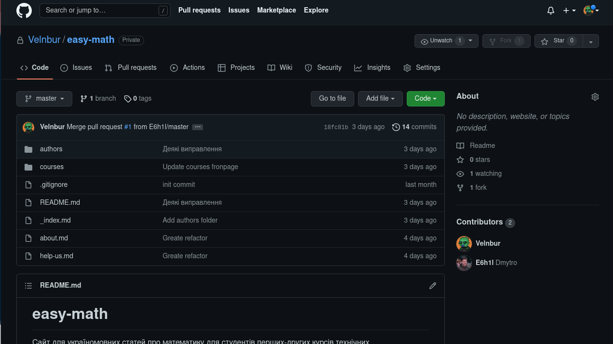

Цей документ повністю присвячений додаванню нових статтей до
репозиторію [content](https://github.com/Velnbur/easy-math).

## Що потрібно?

На данний момент, достатньо:
- Мати браузер на комп'ютері
- Мати аккаунт на [github](https://github.com/)
- Знати синтаксис файлів статтей (це обговрюється [тут](/guides/how-to-write-articles/))

## Додавання нової статті

1. Спочатку потрібно додати існуючий репозиторій [content](https://github.com/Velnbur/easy-math)
  до свого аккаунту. Для цього, перейшовши на сторінку з цим
  репозиторієм у правому верхньому кутку нажміть кнопку `Fork`.
  Перед вами має відкритися нова сторінка цього ж репозиторія,
  але на цей раз під посиланням щось типу такого:
   `github.com/<ім'я користувача>/content`
  > Тепер в своєму аккаунті ви маєте копію цього проєкту. Тим
  > самим у вас з'являється можливість локально редагувати та
  > додавати статті, поки що, не впливаючи на стан головного
  > джерела
2. Аби почати редагувати проєкт у браузері, нажміть
  клавішу `.` на клавіатурі, перед вами має відкритися
  веб інтерфейс текстового редактору **Visual Studio Code**.
  Далі ви маєте повністю працююче середовище для написання статтей
  у браузері!
  > Якщо ви до цього мали встановлену систему контролю версій
  > **Git** і будь який інший текстовий редактор, що підтримує
  > передперегляд **markdown** файлів на своєму комп'ютері, ви
  > можете просто склонувати до себе локально цей репозиторій

3. У лівій панелі, вибравши потрібний вам курс/тему по назві його
  каталогу, створіть новий каталог нажавши правою кнопкою миші
  по ньому і дайте йому назву слідуючи рекомендаціям описаними
  [тут](/guides/recomendations). Також __ОБОВ'ЯЗКОВО__ всередині
  створіть файл під назвою `_index.md` - в якому і буде весь текст
  самої статті.
  > Для прикладу, на відео нижче я вирішив створити статтю під
  > назвою ***"Тестова стаття"*** для курсу ***"Теорія ймовірності"***.
  > Для цього, знайшов каталог під назвою `probability-theory`
  > (що з англ. "Probability Theory" на укр. "Теорія ймовірності"),
  > всередині створив каталог під назвою `test-article`
  > (беремо назву `Тестова стаття` => перекладаємо на англ.
  > `Test article` => переписуємо все з маленькою літерою і заміняємо
  > пробіли на символ `-`, так і отримуємо `test-article`)

4. На цьому пункті ви редагуєте тільки що створенний файл `_index.md`.
  Про те, як створювати нові статті, можете прочати [тут](/guides/how-to-write-articles/)

5. Після закінчення написання статті, у панелі зліва виберіть
  **Source Control**. Має відкритися список із файлами, що
  ви додали або змінили під час цієї сессії. Нажміть на один
  із пунктів і ви побачите порівняння файлу до ваших змін і після.
  Якщо ви вважаєте, все коректним, нажміть на символ `+`, якщо ні -
  на стрілку. І так до поки всі файли не перейдуть до підсписку
  **Staged**

6. Після того, якщо ви вважаєте, що все що потрібно було зроблено,
  у полі вище додайте невеличке повідомлення із підсумуванням тих змін,
  що ви зробили і нажміть на "галку" зверху. Наприклад:
  - Додана тема "Тестова стаття"
  - Виправлено помилку у "Тестова стаття"
  - Видалено зайва "Тестова стаття"

7.  Після цього, всі змінни будуть додані до вашої локальної копії
  репозиторія. Тому останнє, що залишається, запропонувати додати
  ваші змінни до репозиторія оригинільного. Для цього, вам потрібно
  повернутися до вашого репозиторія, знайти на веб сторінці кнопку
  `Pull requests`, і клікнути на `New pull request`.

8. А далі, залишається лише очікувати підтвердження!
